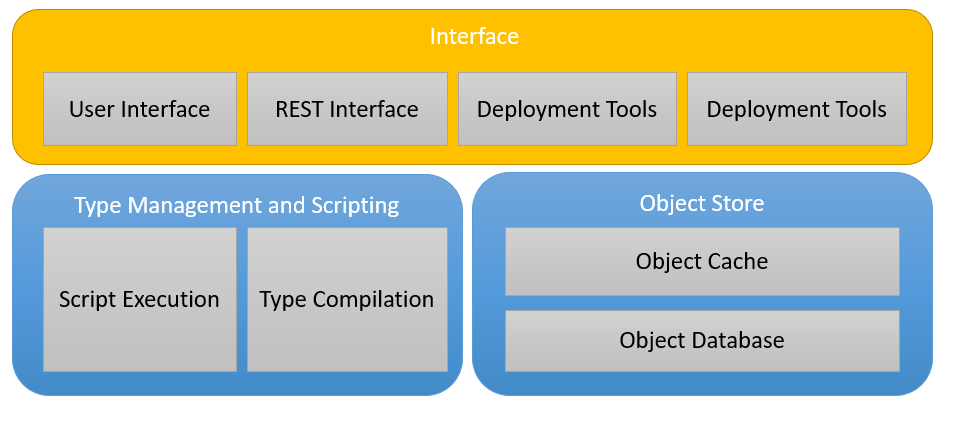
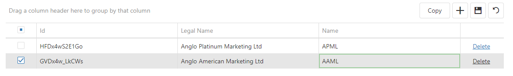

# Interface

TODO

## User Interface

The following list gives the rules for user interactions with the results of a query returned by the [User Interface](#user-interface)

* List of [Persisted Objects](ObjectStore.md#Persisted-Object)
  * Updating, Inserting, Deleting enabled
  * If additional actions configured (e.g. Copy) then multiple selection enabled and action buttons added to tool bar
  * Readonly columns marked with allowUpdating = false
  * Would like to have pop-up form for batch editing - but needs custom work
        
* List of non-persisted objects
  * Update/Insert/Delete explicit options - how?
  * Additional actions as for persisted objects
  * Should auto-select if edited?
* Property that is persisted object
  * Hyper-link to pop-up non-modal form 
  * Drop-down to select object
* [Persisted Object](ObjectStore.md#Persisted-Object)
  * Form with editable and non-editable fields 
  * Update & delete option
  * Action buttons for custom actions
* Non-persisted Object
  * Action buttons for custom actions

  See:
  * [View](View.md)
  * [Page](Page.md)
  * [Menu](Menu.md)

## REST Interface

The API for access to Tesseract is a JSON based REST interface. The API falls into two categories:
* [DevOps API](DevOpsAPI.md) - this is a handcrafted API supporting DevOps operations (deployment, compliation, scripting etc.)
* [View API](ViewAPI.md) - a dynamically generated API for access to any view defined in the system

## Development Tools

TODO

## Deployment Tools

TODO
