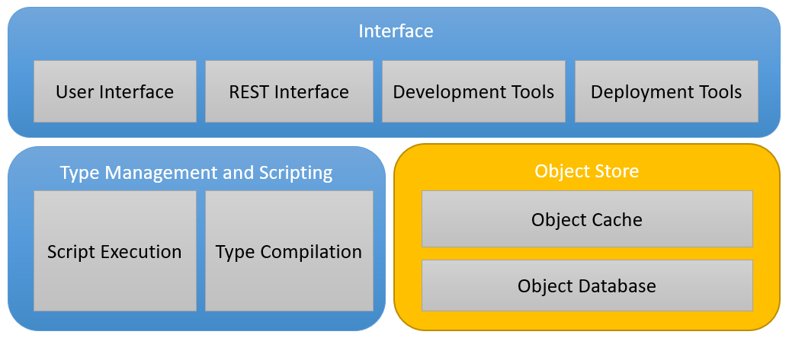
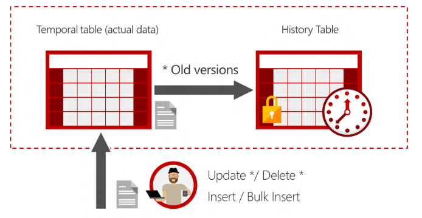

# Object Store



The premise behind [Tesseract](Tesseract.md) is that developing applications using persisted objects is much quicker than using a traditional relational database and business object mapping layer.

Objects are held in an in-memory cache with persistence as JSON blobs to a relational database.

The object database and cache offer a session based, temporal access to data. This means a user can view the state of the application at any point of time and can create versions of data in their session that can be discarded or promoted to other sessions. It's like a version control system for business data.

## Object Database

The **object database** uses Microsoft's SQL Server as a persistent store but has only one main table - the **Object** table. All objects, including meta-data such as: types; users; sessions; etc., is stored in this table.

Every object on creation is allocated a generated ID (using a short GUID algorithm) and is stored in the table. Because we store versions of different objects in sessions (to support what-if scenarios, development, etc.) then then primary key for an object includes a session identifier. The session is itself an object in the store. Although it's session identifier is the default session (empty string) - otherwise it would turtles all the way down!


Likewise an object has a type and the type is an object in the store. Types can have different session IDs but data is only stored against a type with a default session ID. It might be possible to relax this constraint but at this stage its hard to think about.

The object table is implemented as a [Temporal Table](https://docs.microsoft.com/en-us/sql/relational-databases/tables/temporal-tables?view=sql-server-2017). This is a SQL Server feature where the database keeps a history of changes to entries. It does this by having a current table and a history table and has a special query syntax for accessing a point in time snapshot of the data.



The combination of sessions and temporaral tables gives us a versioned store for Business and system meta-data using a very simple model.

An example will make the data structure clearer.

The table below shows a collection of object data stored in the **object** table. This is a view of the current data. The temporal table construct means that an audit history of changes to object data is also maintained.

The detail of any object is stored in the **data** column in JSON format.

At system initiatiion some types were created. Types are the only object that don't have a type ID. In the example below we have 3 types defined:

- Session - a system type used to control changes within a user session. This construct means different versions of data can be stored in what-if scenarios; exploratory chanages etc.
- User - an object that will be integral to the [access control](Security) mechanisms in the system.
- Deal - a domain application type defined to support some sort of trading application in Tesseract.

We have two instance objects representing users registered to the sytem (Alice & Bob). Note the foreign key to the type that defines these as user data. Further note that these instances belong in the default session (blank session IDs).

We have a deal entered into the system (called "deal_1" with a price of 100). We also have a shared session owner by Alice and a modified version of "deal_1" in this session. This would allow Alice to explore the consequences of modifying the deal (and related objects). She may discard the session or try and promote her changes to the default session.

Lastly, we have a session owned by Bob that he is using to update a version of the deal type. Perhaps Bob is doing some development in the system and will not commit his changes (i.e. promote to the default session) until they have been tested.


## Object Cache


### Queries

```csharp
class ObjectQuery
{
    DateTime AsOf {get;set;}
    string SessionID {get; set;}
    Type Type {get; set}
    IEnumerable<PartiionPredicate> Predicates {get; set;}
}
```

### Security

The **object cache** implements access control policies to the all the data in the **object store**. The only way to access data is via the **object cache** and it will enforce Create, Read, Update, Delete (CRUD) access to all objects using an Attribute Based Access Control ([ABAC](https://csrc.nist.gov/projects/abac/)) scheme.

ABAC is the successor to Role Based Access Control (RBAC) and gives a much more flexible security model. RBAC can be implemented in ABAC by adding role properties to subject and object in the model.