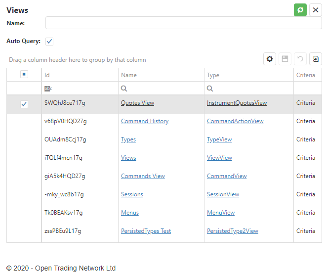

#View
The View is the primary user interface construct that users (and integration tools) use to access and update data in the system.

A View is defined as a Tesseract type with:
* Criteria to select what data is being viewed
* Data structure for the data corresponding to different views of the underlying data (e.g. grid view vs chart view)
* Actions that can be performed on the data

The simplest example of a view is a report that returns rows of data in a grid. For example the following screenshot shows a view of views defined in the system!

In the above example there is simple criteria:
* Name to match against views 
* Auto Query = yes/no to control if the view returns data on opening

In this example the data is rendered in a grid and the only actions available are standard update and view management actions.

Defines a view creates not only a user interface it also creates a dynamic API for systematic access to the same data (see [View API](ViewAPI.mv)).