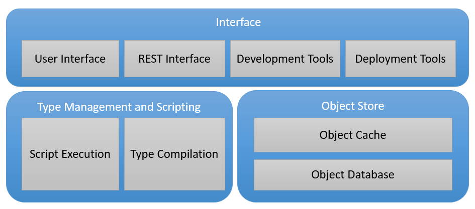

# Tesseract

Tesseract is a enterprise solution for flexible, high performant applictions based on an object store and scripting

The following topics describe the 5 major components in the architecture. It is recommended to read the topics in the following order:

- [Object Store](ObjectStore.md)
- [Compilation and Scripting](CompilationAndScripting.md)
- [Interface](Interface.md)
- [Development Tools](DevelopmentTools.md)
- [Deployment Tools](DeploymentTools.md)
  